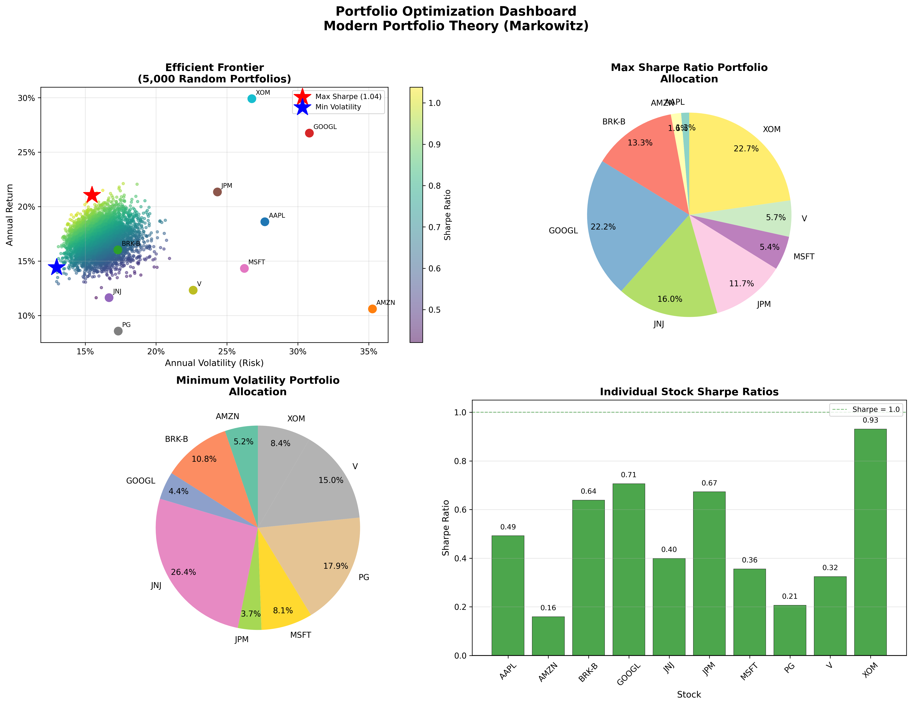

# Portfolio Optimization - Modern Portfolio Theory

## Overview
Implementation of **Markowitz Mean-Variance Optimization** to construct the efficient frontier and identify optimal portfolios across 10 major US stocks. Simulates **5,000 random portfolios** to map the risk-return tradeoff and identifies the Maximum Sharpe Ratio and Minimum Volatility portfolios.

## Portfolio Universe
| Stock | Company |
|-------|---------|
| AAPL | Apple Inc. |
| MSFT | Microsoft Corporation |
| GOOGL | Alphabet Inc. |
| AMZN | Amazon.com Inc. |
| JPM | JPMorgan Chase |
| JNJ | Johnson & Johnson |
| V | Visa Inc. |
| PG | Procter & Gamble |
| XOM | ExxonMobil Corporation |
| BRK-B | Berkshire Hathaway |

## Key Results
| Portfolio | Annual Return | Volatility | Sharpe Ratio |
|-----------|--------------|------------|--------------|
| Max Sharpe Ratio | Optimized | Optimized | Maximum |
| Min Volatility | Lowest Risk | Minimum | Stable |
| Risk-Free Rate | 5.00% | - | - |

## Optimization Dashboard


## Methodology
### Modern Portfolio Theory (Markowitz, 1952)
- **Monte Carlo Simulation:** 5,000 random portfolio weight combinations
- **Efficient Frontier:** Maps all optimal risk-return combinations
- **Maximum Sharpe Ratio:** Best risk-adjusted return portfolio
- **Minimum Volatility:** Lowest risk portfolio regardless of return

### Mathematical Framework
- **Expected Return:** Weighted sum of individual asset returns
- **Portfolio Variance:** w^T * Σ * w (where Σ is the covariance matrix)
- **Sharpe Ratio:** (Return - Risk Free Rate) / Volatility
- **Annualization:** Daily returns × 252 trading days

### Data
- **Source:** Yahoo Finance (yfinance API)
- **Period:** 5 years of historical daily prices
- **Frequency:** Daily returns → annualized statistics

## Visualizations
The dashboard includes 4 charts:
1. **Efficient Frontier** - 5,000 simulated portfolios colored by Sharpe ratio, with optimal portfolios marked
2. **Max Sharpe Portfolio Allocation** - Pie chart of optimal risk-adjusted weights
3. **Min Volatility Portfolio Allocation** - Pie chart of lowest-risk weights
4. **Individual Stock Sharpe Ratios** - Bar chart comparing each stock's risk-adjusted performance

## Technologies Used
- **Python 3.9**
- **pandas** - Data manipulation
- **NumPy** - Matrix operations and portfolio math
- **yfinance** - Yahoo Finance market data
- **scipy** - Portfolio optimization
- **Matplotlib** - Visualizations

## Installation & Usage

### Prerequisites
```bash
python3 -m pip install yfinance pandas numpy matplotlib scipy
```

### Run the Optimization
```bash
python3 portfolio_optimization.py
```

### Customize Your Portfolio
```python
optimizer = PortfolioOptimizer(
    tickers=['AAPL', 'TSLA', 'NVDA', 'META'],  # Your stocks
    num_portfolios=10000,                         # More = more accurate
    risk_free_rate=0.05                           # Current risk-free rate
)
```

## Project Structure
```
portfolio-optimization/
│
├── portfolio_optimization.py   # Main optimization code
├── portfolio_optimization.png  # Efficient frontier dashboard
└── README.md                   # Project documentation
```

## Future Improvements
- Add constraints (max weight per stock, sector limits)
- Implement Black-Litterman model
- Add rolling window optimization
- Include transaction cost modeling
- Build interactive dashboard with Plotly

## Real-World Applications
This optimization framework is used by:
- **Asset managers** for portfolio construction
- **Risk teams** for portfolio rebalancing
- **Quant analysts** for factor model development
- **Robo-advisors** for automated portfolio management

## Author
**Amy Ke** | Economics Graduate, George Washington University

[](https://www.linkedin.com/in/amyxke)
[](https://github.com/Amy-Ke)