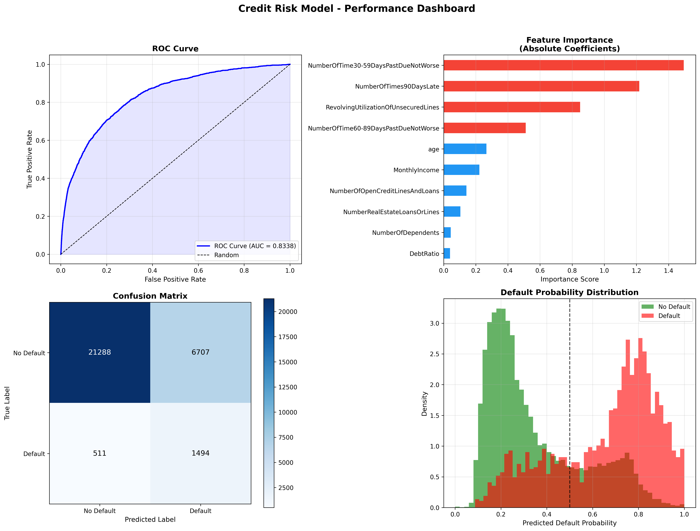

# Credit Risk Model - Loan Default Prediction

## Overview
A machine learning model that predicts the probability of loan default using logistic regression. Built and validated on **150,000 real borrower records** from the Give Me Some Credit dataset. Achieves an **AUC score of 0.8338**, demonstrating strong discriminatory power between defaulting and non-defaulting borrowers.

## Model Performance
| Metric | Score |
|--------|-------|
| AUC Score | 0.8338 |
| Accuracy | 75.94% |
| Recall (Default Detection) | 74.51% |
| Precision | 18.22% |
| True Positives (Defaults Caught) | 1,494 |
| False Negatives (Missed Defaults) | 511 |
| Training Set | 120,000 borrowers |
| Test Set | 30,000 borrowers |

## Dataset Overview
| Statistic | Value |
|-----------|-------|
| Total Borrowers | 150,000 |
| Default Rate | 6.68% |
| Average Age | 52.3 years |
| Avg Monthly Income | $5,400 |
| Avg Debt Ratio | 226.33% |
| Avg Open Credit Lines | 8.5 |

## Key Findings
- **#1 Predictor of Default:** Number of times 30-59 days past due - payment history is the strongest signal of future default
- **#2 Predictor:** Number of times 90+ days late - severe delinquency dramatically increases default probability
- **#3 Predictor:** Revolving credit utilization - high utilization signals financial stress
- **Age and income** are less predictive than payment behavior, suggesting behavioral factors outweigh demographic ones
- Model successfully handled **class imbalance** (only 6.68% defaults) using balanced class weights
- **33,655 missing values** identified and imputed using median strategy before modeling

## Performance Dashboard


## Methodology
### Data Preprocessing
- Loaded and cleaned 150,000 borrower records
- Imputed missing values using median imputation for MonthlyIncome and NumberOfDependents
- Clipped outliers in revolving utilization (0-100%), debt ratio, and age
- Standardized all features using StandardScaler for logistic regression

### Feature Engineering
10 features used for prediction:
1. Revolving utilization of unsecured lines
2. Age
3. Number of times 30-59 days past due
4. Debt ratio
5. Monthly income
6. Number of open credit lines and loans
7. Number of times 90 days late
8. Number of real estate loans or lines
9. Number of times 60-89 days past due
10. Number of dependents

### Model Selection
- **Algorithm:** Logistic Regression with balanced class weights
- **Train/Test Split:** 80/20 with stratification
- **Evaluation Metrics:** AUC-ROC, accuracy, precision, recall, confusion matrix

## Technologies Used
- **Python 3.9**
- **pandas** - Data manipulation and cleaning
- **NumPy** - Numerical computations
- **scikit-learn** - Machine learning model and evaluation
- **Matplotlib** - Performance visualization

## Installation & Usage

### Prerequisites
```bash
python3 -m pip install pandas numpy scikit-learn matplotlib
```

### Run the Model
```bash
python3 credit_risk_model.py
```

### Expected Output
- Performance metrics printed to console
- ROC curve, feature importance, confusion matrix, and probability distribution charts
- `credit_risk_performance.png` saved to directory

## Project Structure
```
credit-risk-model/
│
├── credit_risk_model.py         # Main model and pipeline code
├── credit_risk_performance.png  # Performance visualization
├── cs-training.csv              # Training dataset (150K borrowers)
└── README.md                    # Project documentation
```

## Future Improvements
- Implement Random Forest and XGBoost for comparison
- Add cross-validation for more robust evaluation
- Develop risk scoring system (probability bands: Low/Medium/High risk)
- Add SHAP values for model interpretability
- Build interactive dashboard for risk assessment

## Real-World Applications
This type of model is used by:
- **Banks** for credit card and loan approval decisions
- **Fintech companies** for real-time lending decisions
- **Risk management teams** for portfolio stress testing
- **Regulators** for CECL/IFRS9 reserve calculations

## Author
**Amy Ke** | Economics Graduate, George Washington University

[](https://www.linkedin.com/in/amyxke)
[](https://github.com/Amy-Ke)